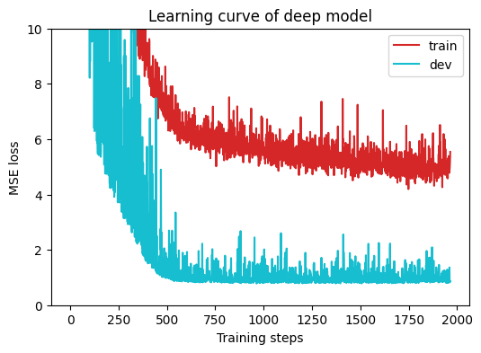
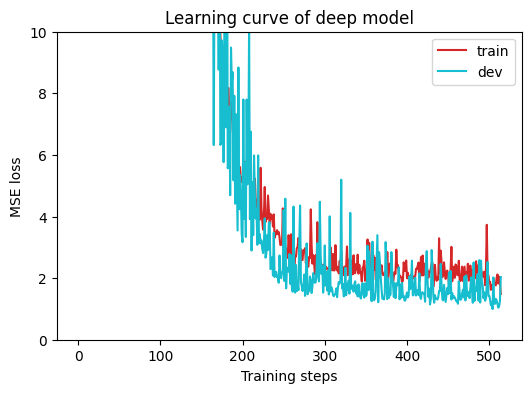
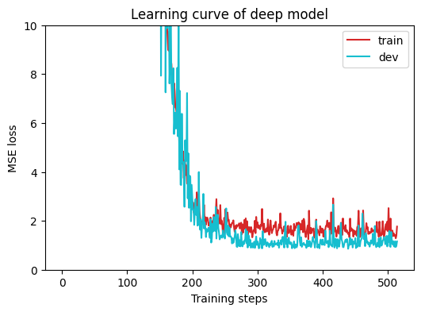
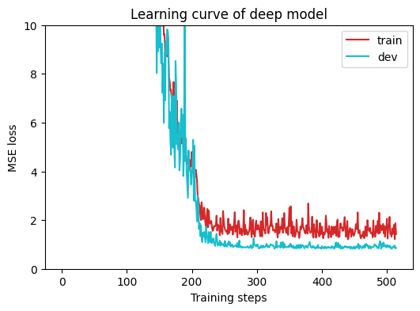
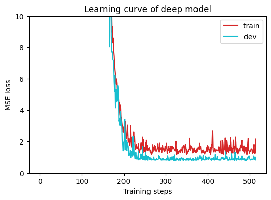
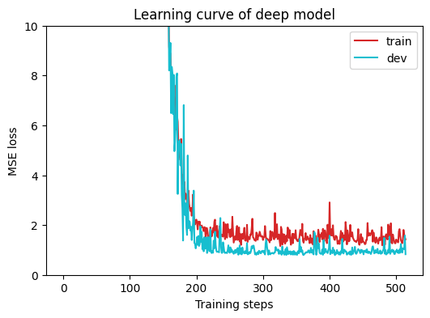

# FuzzyTorch

## Brief Description
This repository presents an implementation of the hierarchical fused deep neural network model proposed by Deng et al. (2017). It is applied to a COVID-19 dataset from Kaggle for regression purposes.

## Model Architecture
In this code, the model comprises the following components:
* The Fuzzy Component
    1. FuzzyLayer:
        This layer obtains fuzzy logic representations by passing each dimension of the input vector through a fuzzy membership function, utilizing Gaussian distribution.

    2. FuzzyRuleLayer:
        Element-wise multiplication is performed on all fuzzy logic representations.

    3. MFLayer:
        A wrapper layer that encapsulates FuzzyLayer and FuzzyRuleLayer. Please note that in the `forward` method, I divided the input tensors by features to calculate logic representations individually.

* The Dense Layer Component
    1. DenseLayer:
        Consists of two `nn.Linear` layers.

* The Fusion Layer Component
    Combines the output of the fuzzy component and the dense layer component through concatenation. After concatenation, the two representations are fused using another `nn.Linear` layer.

Note: I switched the activation function from sigmoid to ReLU because using sigmoid was resulting in slow convergence.

## Experiments

The main focus of my current experiment revolves around examining how the number of membership function nodes affects the model's performance during training. To address this, I have employed a two-layer Deep Neural Network (DNN) as a baseline, with 16 neurons in the intermediate layer. As for the Linear Layers in FuzzyNet, each layer is configured with 8 neurons.

### Baseline Model

The image above represents the performance of the Baseline model. It is evident that convergence during training is relatively unstable, and it requires a higher number of epochs to reach convergence.

### FuzzyNet - G2

`FuzzyNet - G2` means every feature goes through 2 membership function. It seems that the variation of training data and validation data during training are slightly smaller than `Baseline Model`. Also it took lesser epoch for `FuzzyNet` to converge.

### FuzzyNet - G4

`FuzzyNet - G4` means every feature goes through 4 membership function. The variation seems to get smaller than `FuzzyNet - G4`.

### FuzzyNet - G16

`FuzzyNet - G2` means every feature goes through 2 membership function.

### FuzzyNet - G32

`FuzzyNet - G2` means every feature goes through 2 membership function.

### FuzzyNet - G64

`FuzzyNet - G2` means every feature goes through 2 membership function.